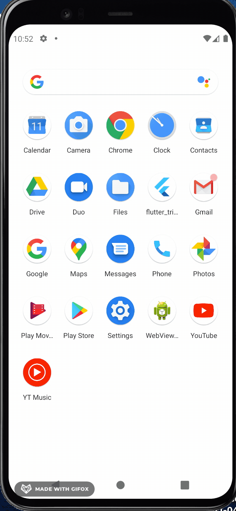
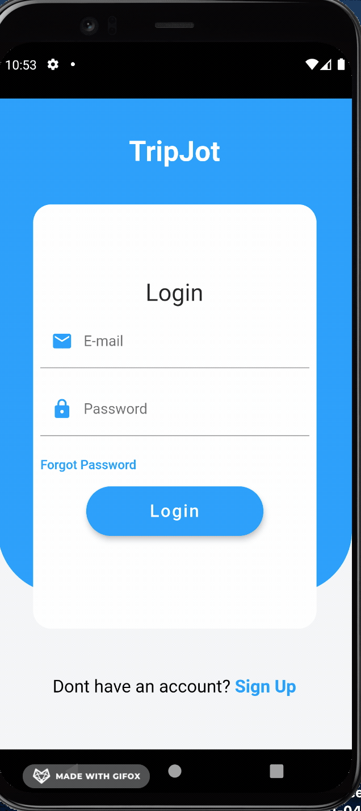
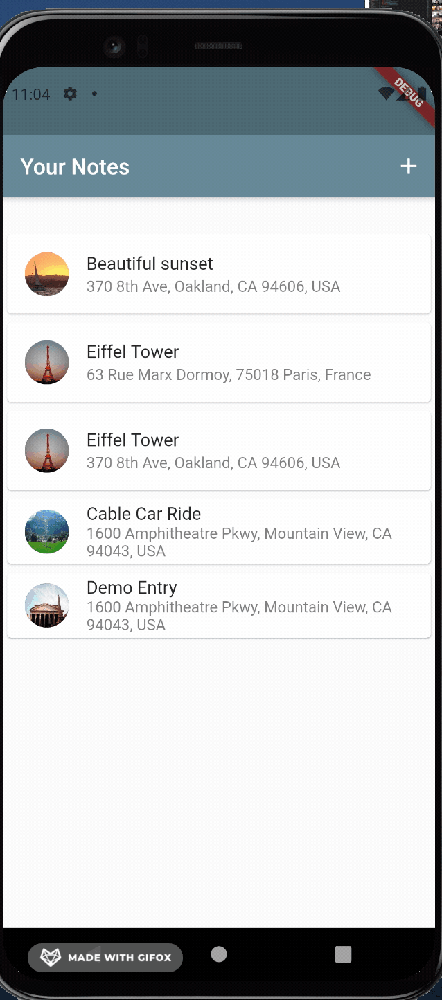
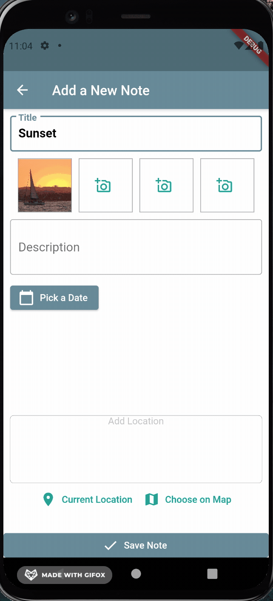
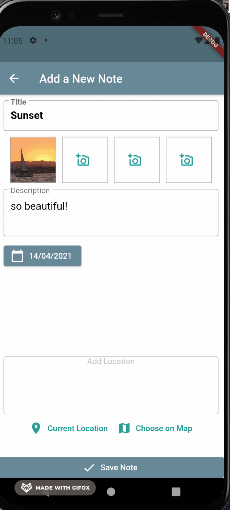
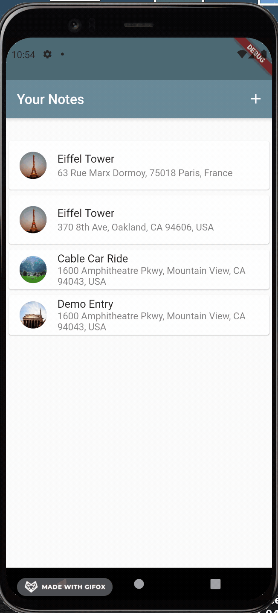

# TripJot

[Sheeba Nair](https://github.com/sheebanair "Sheeba Nair")

# Overview

TripJot is a passion project - a microservice android app built so that users can store and access all their memories in one place, while on the go. One of the primary features include login and sign up options, so users can ensure all data is privately stored for their viewing. Users can add a new note - which has details such as pictures, location (as chosen on maps, linked with the Goggle Maps API), calendar, title and description/notes. The notes currently persist in the local storage of the user's phone, but future modifications will allow for cloud storage. Notes can be viewed and tagged locations can also be viewed in a Map View. Future updates will also include different Views (Maps, Calendar, Listed Notes). The app currently allows the user to delete notes and in the near future, users can go back and edit previously stored notes as well.

# Tech Stack

<ul>
  <li>Flutter</li>
  <li>Android Studio </li>
  <li>Firebase Authentication </li>
  <li>Google Maps API </li>
</ul>

# User Stories

<ul>
  <li> As a user, I should be able to see a splash screen, every time I open the app</li>
  <li> As a user, I should be able to login or create a new account</li>
  <li> As a user, I should be able to add photos and description to a new note. I should also be able to add a title and choose a particular day to associate the memory with</li>
  <li> As a user, I should be able to choose my current location or a location on the map to associate a particular note/memory with</li>
  <li> As a user, I should be able to view all my previously saved notes in a chronological format</li>
  <li> As a user, I should be able to view the details of a previosuly saved note and have a map view linked as well</li>
  <li> As a user, I should be able to delete notes with a swipe</li>
</ul>

# How does the app work?
Splash Screen:
 

Login and Register:
 

Add Title and Photo:
 

Add Date and Description:
 

Add Location and Save Note:
 

View Previous Notes and Delete Notes:
 

